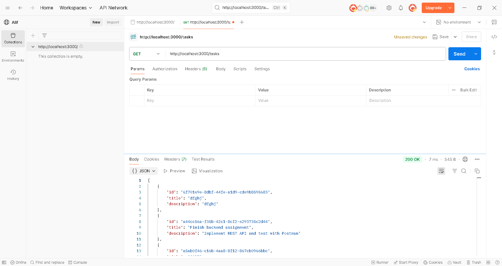

# 📝 Task Manager API – Node.js & Express


It is a **RESTful API** to manage tasks (like a to-do list) using **Node.js and Express**.  
The API supports full **CRUD operations** and stores data **in-memory** (no database used).

---

## ✅ Features

- Create a new task
- Get all tasks
- Get a task by ID
- Update a task
- Delete a task
- Basic input validation
- Clean error handling
- Postman-tested endpoints

---

## 🚀 How to Run the Project

```bash
git clone https://github.com/your-username/task-manager-api.git
cd task-manager-api
npm install
node index.js


---


## following is the result on postman
GET /tasks
✅ Fetch all tasks


## 📸 Postman Result: GET /tasks

✅ Fetch all tasks



